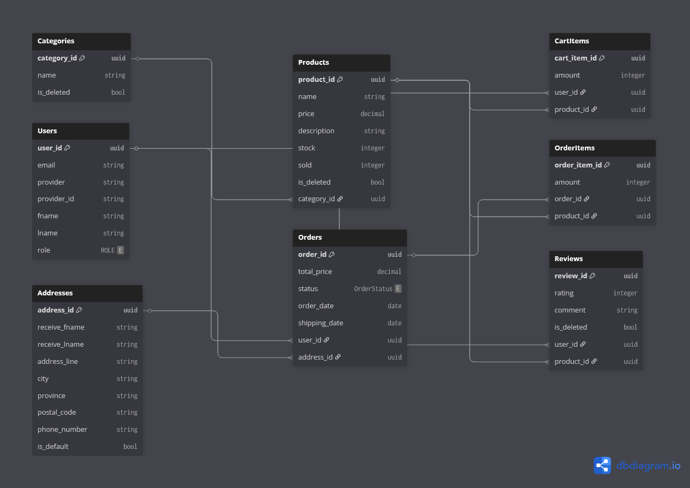

# 🛍️ E-Commerce Project

This is a **Backend E-Commerce Web Application Project** built using **Spring Boot** and **PostgreSQL**, designed to demonstrate real-world features such as authentication, CRUD operations, payment integration, and CI/CD deployment automation.

---

## 🚀 Tech Stack

| Category | Technology |
|-----------|-------------|
| **Backend Framework** | Spring Boot |
| **Database** | PostgreSQL (with Spring Data JPA) |
| **Database Management** | pgAdmin |
| **CI/CD** | GitHub Actions |
| **Containerization** | Docker (Build Dockerfile to create Docker Image for Deployment) |

---

## ✨ Key Features

### 🔐 Authentication
- User login via **OAuth 2.0** (Google)

### 📚 Category Management
- **CRUD operations** for Product Categories  

### 📦 Product Management
- **CRUD operations** for Products with **Pagination support**

### 🛒 Shopping Cart
- **Add / Remove / Update items** in the cart  
- View items in a user’s cart

### 📬 Order System
- **Create orders directly from shopping cart items**  
- **Manage order status** (Pending, Paid, Canceled)

### 💳 Payment System
- Integrated with **Stripe API** for real payment processing  
- Webhook handling for **payment status updates**

### ⭐ Product Reviews
- **CRUD operations** for product reviews (supports rating and comments)

---

## 📊 System Design (ER Diagram)

Below is the Entity Relationship Diagram (ERD) representing the database structure of this project

---

